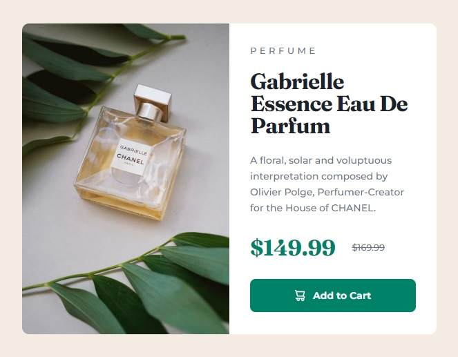
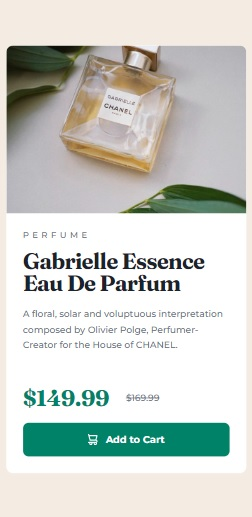

# Frontend Mentor - Product preview card component solution

This is a solution to the [Product preview card component challenge on Frontend Mentor](https://www.frontendmentor.io/challenges/product-preview-card-component-GO7UmttRfa). Frontend Mentor challenges help you improve your coding skills by building realistic projects. 

## Table of contents

- [Overview](#overview)
  - [The challenge](#the-challenge)
  - [Screenshot](#screenshot)
  - [Links](#links)
- [My process](#my-process)
  - [Built with](#built-with)
  - [What I learned](#what-i-learned)
  - [Continued development](#continued-development)
  - [Useful resources](#useful-resources)
- [Author](#author)
- [Acknowledgments](#acknowledgments)

## Overview

### The challenge

Users should be able to:

- View the optimal layout depending on their device's screen size
- See hover and focus states for interactive elements

### Screenshot

| Desktop layout |
|:--:|


| Mobile layout |
|:--:|


### Links

- Solution URL: https://github.com/PavlinaPs/product-preview-card-component
- Live Site URL: https://pavlinaps.github.io/product-preview-card-component/

## My process

### Built with

- Semantic HTML5 markup
- CSS custom properties
- Flexbox
- CSS Grid
- Mobile-first workflow
- BEM

### What I learned

Originally I wanted to code this layout with Bootstrap. Unfortunately I wasn't able to do it.

I dedided to code it vanilla in the end. I debated with myself, if the Add to cart element should be a button or a link styled as a button. I think it should be a button of submit type, in a form, because it submits the choice to the shopping cart.

```html
<form action="#">
  <button class="card__add-button" type="submit">
     
    Add to Cart
  </button>
</form>
```

### Continued development

I still want to do this challenge with Bootstrap, with Sass modifications and all. I need to learn it first.

### Useful resources

- [HTML Button Link Code Examples – How to Make HTML Hyperlinks Using the HREF Attribute on Tags](https://www.freecodecamp.org/news/html-button-link-code-examples-how-to-make-html-hyperlinks-using-the-href-attribute-on-tags/) - On the button or link topic.

## Author

- GitHub - [PavlinaPs](https://github.com/PavlinaPs)
- Frontend Mentor - [@PavlinaPs](https://www.frontendmentor.io/profile/PavlinaPs)

## Acknowledgments

It is great that I can solve Frontend Mentor's challenges. They are all very useful for me. Every single one. Thank you!
